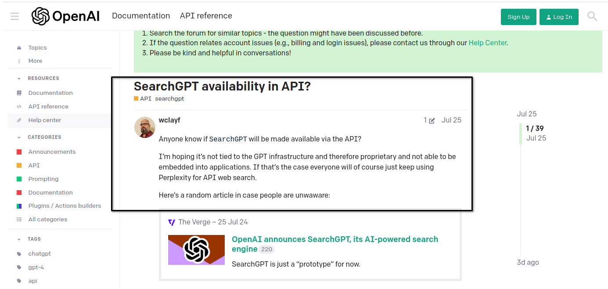
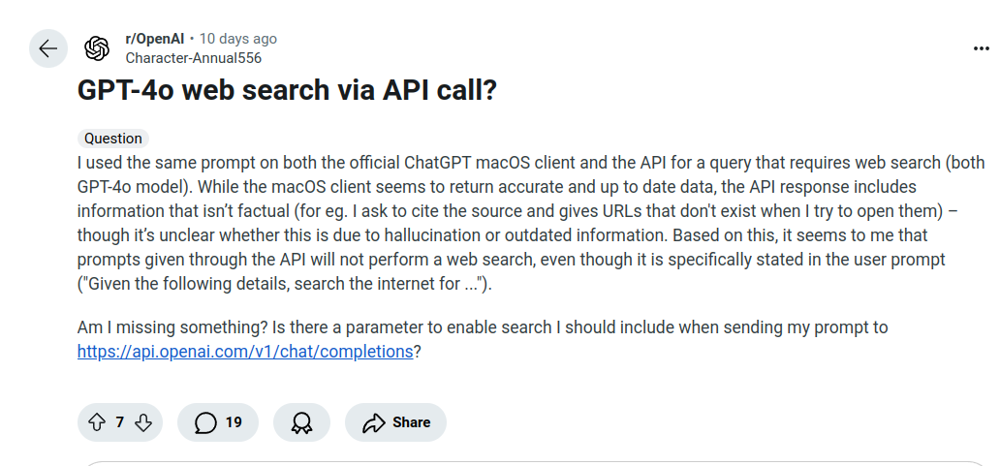

# Real Time News Summarisation Capabilities

Date: 13-11 (Nov) - 2024
Author: Daniel Rosehill

## Objective

To assess the capabilities of various LLMs in very recent information retrieval by prompting for details about a recent world news event.

Given that real time information retrieval is a relatively recent "innovation" enabled by external/supplementary technologies like RAG expectations were modest but it was useful to assess:

- How do outputs generated through a web UI and API compare when the underlying LLM is the same or very similiar?
- Do OpenAI's GPT models provide any indication of being able to leverage the search enhancement feature when used programatically?
- How do the outputs from LLMs compare with some of the emerging search tools to enable this powerful add-on capability for LLMs?   

---

## Prompt

```
 Today, US President-Elect Donald Trump announced the formation of a new government department and announced that a famous tech entrepeneur would lead it. 

 Can you provide more information about this?
 ```

---

## Image

Despite the collosal global interest in both OpenAI's tools and LLMs generally, there remains significant confusion and ambiguity around basic questions like: *"does the APi offer the real time search or just the web UI?"*

This is reflected in discourse in developer-centric communities such as OpenAI's own community forums and the OpenAI subreddit (/r/openai):

- 



*(The answer from the community: the API alone will not return outputs leveraging the search capability; a search and LLM API need to be combined to enable this).*

---

## Findings

Some notes:

- ChatGPT gave a 134 response via the web UI
- Perplexity expanded that to 422 words providing more detail and analysis. 
- Comparing the response with the Wikipedia entry for the planned entity at the time of this writing suggests that it or similar sources were leveraged to expand upon the baseline of information supplied through the underlying LLM.  
-  Interestingly, when ChatGPT was accessed via an API integration (frontend: Jan) the prompt was met with a knowledge cutoff refusal. The result with other GPT variants was the same. 
-  Qwen was not able to retrieve the information although it does claim some real time / RAG-augmented capabilities and searches for other news events yielded some responses. 
-  Comparing the response from ChatGPT with that produced with Tavily and Open Perplex is highly interesting. The Open Perplex response in particular stands out for its structured formatting and depth of analyis compared to the more blunt summary of facts offered by ChatGPT's web UI.   

## Conclusions

Among the commercially available large language models which offer the emerging capability of inference enhanced by ingestion of real-time or near real time data, there is some interesting variance.

Perplexity AI (and Microsoft Copilot, not captured in this run) shows how even proprietary systems based around the same core LLM can yield quite different outputs. 

The capabilities of search layers are highly interesting and point to hopefully better performance in downstream technologies.