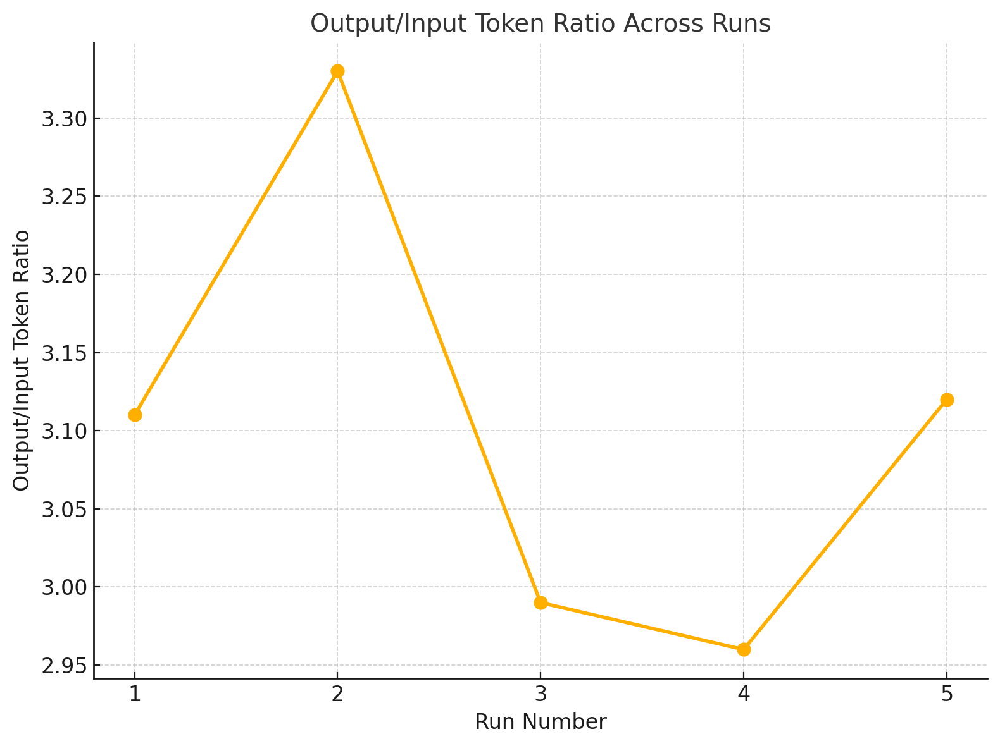

## Intro

I chose this prompt for this short experiment as it is relatively complex and was iterated through several improvements (I realised that *all* of the details needed to be provided, including the specific branch). Example Github repositories are provided to nudge the LLM toward producing "personalised" documentation

## Date & Platform

Date: 22-Nov-24  
LLM: GPT-4o  
Platform: ChatGPT via web UI

## Prompt

For text of prompt, see:

[`prompt.md`](prompt)

## Prompt Parameters (GPT4o)

Tokens: 284  
Characters: 1311

## Outputs

For outputs, see:

[`outputs.md`](outputs)

## Results

### Output length variability

The prompt was run 5 times on ChatGPT with the following output characters and tokenisation (for GPT4o):
 
| Run | Input Tokens | Input Characters | Output Tokens | Output Characters | Output Tokens / Input Tokens |
|-----|--------------|------------------|---------------|-------------------|------------------------------|
| 1   | 284          | 1331             | 883           | 3997              | 3.11                         |
| 2   | 284          | 1331             | 945           | 4331              | 3.33                         |
| 3   | 284          | 1331             | 849           | 3910              | 2.99                         |
| 4   | 284          | 1331             | 841           | 4776              | 2.96                         |
| 5   | 284          | 1331             | 885           | 3920              | 3.12                         |



 

| Metric                                   | Value   |
|------------------------------------------|---------|
| Mean Output Tokens                       | 880.6   |
| Standard Deviation of Output Tokens      | 41.05   |
| Min Output Tokens                        | 841     |
| Max Output Tokens                        | 945     |
| Mean Output Tokens/Input Tokens Ratio    | 3.10    |
| Standard Deviation of Output Tokens/Input Tokens Ratio | 0.15    |


## Content Variability (Scripts)

While the output length and content both demonstrated *broad* consitsency, there were some subtle differences that actually ended up having quite significant effects on how the scripts worked!

While some outputs noted that webhooks had to be configured in GIthub, others did not. 

There were other subtle differences that (again) affected viability greatly.

In Run 2's workflow for the "master" repo, for example, it used this command to pull submodule updates:

```bash
git submodule update --remote --merge
```
But in the next output, GPT had decided that the `--merge` flag was no longer necessary:

```bash
git submodule update --remote
```

Differences can also be seen in the payload-delivery format.

While GPT can be helpful for generating code to support somewhat complex workflows such as the one requested in the prompt, the results demonstrate a degree of inconsistency that pervents total reliability, despite attempts to ensure it.

 ## ChatGPT's Self Analysis

Note: in my prompt, to try to mitigate bias, I didn't tell GPT that it was looking at its *own* outputs!

Rather, I prompted:

### Prompt

Analyse this list of LLM outputs for the same prompt. 

Highlight the differences that can be seen between the various outputs

### Output

## **Differences in Outputs**

### **1. Structure and Level of Detail**
- **Run 1**: Provides a very detailed step-by-step guide, including specific instructions for setting up webhooks, creating GitHub Actions workflows, and linking feeder repositories to the root repository. It also includes YAML code snippets for both feeder and root repository workflows, along with explanations of each step.
- **Run 2**: While still detailed, it condenses some explanations and focuses more on summarizing the workflow. It introduces additional context, such as ensuring MKDocs builds automatically on Netlify, but omits some granular details compared to Run 1.
- **Run 3**: Offers a more streamlined explanation. The focus is on simplicity, with fewer steps and less emphasis on webhook setup details. It assumes some prior knowledge about GitHub Actions and submodules.
- **Run 4**: Similar to Run 3 in terms of brevity but introduces alternative tools like `peter-evans/repository-dispatch` for triggering events. This adds flexibility but also complexity compared to other runs.
- **Run 5**: Balances detail and simplicity. It provides clear YAML examples but avoids overloading with too much context. It emphasizes security (e.g., using `DEPLOY_PAT`) and provides practical tips for submodule configuration.

### **2. Workflow Design**
- **Runs 1, 2, and 5**: Focus on using webhooks in the feeder repository to notify the root repository via a `repository_dispatch` event. They emphasize GitHub-native solutions without external dependencies.
- **Run 4**: Introduces the use of `peter-evans/repository-dispatch`, a third-party GitHub Action, to handle notifications between repositories. This approach is slightly more advanced but may require additional setup.
- **Run 3**: Simplifies the workflow by focusing on direct updates to submodules without explicitly detailing webhook configurations or advanced triggering mechanisms.

### **3. Code Examples**
- All runs include YAML snippets for GitHub Actions workflows, but the level of detail varies:
  - **Run 1**: Contains the most comprehensive examples, covering multiple scenarios (e.g., webhook setup, submodule updates, MKDocs build triggers).
  - **Runs 2 and 5**: Provide concise YAML examples that are easier to follow but may lack some nuanced steps.
  - **Run 3**: Includes minimal YAML code, focusing only on essential steps.
  - **Run 4**: Introduces alternative syntax (e.g., `peter-evans/repository-dispatch`) not seen in other outputs.

### **4. Security Considerations**
- All runs mention using a Personal Access Token (`DEPLOY_PAT`) for authentication, but the emphasis varies:
  - **Runs 1 and 5**: Highlight the need for appropriate permissions (e.g., `repo` and `workflow` scopes) and provide explicit instructions for adding secrets in GitHub.
  - **Runs 2 and 3**: Mention `DEPLOY_PAT` but do not elaborate as much on permissions or security configurations.
  - **Run 4**: Uses `DEPLOY_PAT` in conjunction with a third-party action, which may raise additional security considerations.

### **5. Assumptions About User Knowledge**
- **Runs 1 and 2**: Assume minimal prior knowledge and provide detailed explanations for every step.
- **Runs 3 and 4**: Assume intermediate familiarity with GitHub Actions and submodules, offering less explanation for basic concepts.
- **Run 5**: Strikes a balance by providing enough context while avoiding overly detailed explanations.

### **6. Focus Areas**
- **Run 1**: Comprehensive focus on all aspects of the workflow—webhooks, GitHub Actions, submodule updates, MKDocs builds.
- **Run 2**: Emphasizes integration with Netlify and MKDocs auto-build triggers.
- **Run 3**: Focuses primarily on submodule updates within GitHub Actions workflows.
- **Run 4**: Highlights flexibility through third-party tools like `peter-evans/repository-dispatch`.
- **Run 5**: Balances all aspects while emphasizing security and practical implementation tips.

---

## **Key Observations**
1. The outputs vary in their level of detail, with Run 1 being the most comprehensive and Run 3 being the most concise.
2. Different approaches to triggering workflows are suggested (e.g., direct webhooks vs. third-party actions).
3. Security considerations are consistently mentioned but emphasized more strongly in Runs 1 and 5.
4. The choice of tools (native GitHub Actions vs. third-party actions) reflects varying levels of complexity across outputs.

---

## **Conclusion**
The differences between these outputs highlight varying priorities—some focus on comprehensiveness (e.g., Run 1), others on simplicity (e.g., Run 3), while others explore alternative tools (e.g., Run 4). Depending on the user's expertise level and specific needs, different runs may be more suitable. For beginners or those seeking step-by-step guidance, Run 1 is ideal; for experienced users looking for concise solutions or flexibility, Runs 3 or 4 may be preferable.

 